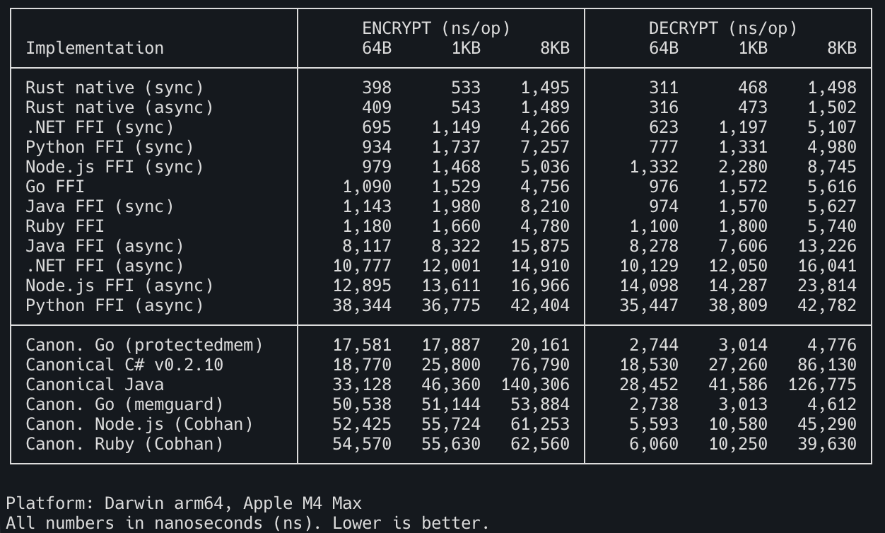

# Asherah

Application-layer encryption with automatic key rotation. Rust implementation
with bindings for Node.js, Python, .NET, Java, Ruby, and Go.

## What is Asherah?

Asherah implements envelope encryption: data is encrypted with a random data key,
which is itself encrypted with an intermediate key, which is encrypted by a
master key held in a KMS. Keys rotate automatically based on configurable
intervals, and old keys remain accessible for decryption while new data is always
encrypted with fresh keys.

This design means application code never handles raw master keys, key rotation
happens transparently, and compromise of a single data key exposes only one
record.

**KMS backends:** AWS KMS (recommended), [HashiCorp Vault Transit](docs/vault-transit-kms.md) (on-prem), [AWS Secrets Manager](docs/secrets-manager-kms.md) (migration only), static (testing only)

**Metastores:** DynamoDB, MySQL, Postgres, SQLite, in-memory (testing only)

## Language Bindings

| Language | Package | Docs |
|----------|---------|------|
| Node.js | [`asherah`](https://www.npmjs.com/package/asherah) on npm | [README](asherah-node/) |
| Python | [`asherah`](https://pypi.org/project/asherah) on PyPI | [README](asherah-py/) |
| .NET | `GoDaddy.Asherah.AppEncryption` on [GitHub Packages](https://github.com/godaddy/asherah-ffi/packages) | [README](asherah-dotnet/) |
| Java | `com.godaddy.asherah:appencryption` on [GitHub Packages](https://github.com/godaddy/asherah-ffi/packages) | [README](asherah-java/) |
| Ruby | `asherah` on [GitHub Packages](https://github.com/godaddy/asherah-ffi/packages) | [README](asherah-ruby/) |
| Go | [`github.com/godaddy/asherah-go`](https://pkg.go.dev/github.com/godaddy/asherah-go) | [README](asherah-go/) |

## Platform Support

| Platform | Architecture | Status |
|----------|-------------|--------|
| Linux | x86_64 (glibc) | Supported |
| Linux | x86_64 (musl) | Supported |
| Linux | ARM64 (glibc) | Supported |
| Linux | ARM64 (musl) | Supported |
| macOS | x86_64 | Supported |
| macOS | ARM64 (Apple Silicon) | Supported |
| Windows | x64 | Supported |
| Windows | ARM64 | Supported |

## Quick Start

```js
const asherah = require('asherah');

asherah.setup({
  serviceName: 'my-service',
  productId: 'my-product',
  metastore: 'memory',   // testing only — use 'rdbms' or 'dynamodb' in production
  kms: 'static',         // testing only — use 'aws' in production
});

const ct = asherah.encryptString('partition', 'secret data');
const pt = asherah.decryptString('partition', ct);

asherah.shutdown();
```

See each binding's README for complete examples including async APIs,
session-based usage, and production configuration.

## Performance

The Rust core delivers sub-microsecond encrypt/decrypt. All language bindings
stay under 2μs for sync operations. The table includes both sync and async
variants, plus head-to-head comparison with the canonical Go/C#/Java
implementations:



See each binding's README for detailed async behavior and per-metastore
performance characteristics.

## Architecture: Key Hierarchy and Secure Caching

Asherah uses a four-level key hierarchy with envelope encryption:

```
┌─────────────────────────────────────────────────────────┐
│                    KMS Backend                          │
│         (AWS KMS / Vault Transit / Static)              │
│                                                         │
│  Master Key ── never exposed, encrypt/decrypt via API   │
└─────────────┬───────────────────────────────────────────┘
              │ encrypts
┌─────────────▼───────────────────────────────────────────┐
│              System Key (SK)                             │
│  Stored in metastore, cached in memory, auto-rotated    │
└─────────────┬───────────────────────────────────────────┘
              │ encrypts
┌─────────────▼───────────────────────────────────────────┐
│          Intermediate Key (IK)                           │
│  Per-partition, stored in metastore, auto-rotated       │
└─────────────┬───────────────────────────────────────────┘
              │ encrypts
┌─────────────▼───────────────────────────────────────────┐
│           Data Row Key (DRK)                             │
│  Random per-record, inline in ciphertext (envelope)     │
└─────────────┬───────────────────────────────────────────┘
              │ encrypts
              ▼
         Your Data
```

### Secure Memory Architecture

All key material is protected by a custom memory guard system:

```
┌─────────────────────────────────────────────────────────┐
│               mlock'd Page (4KB)                        │
│          Pinned in RAM, never swapped to disk            │
├─────────────────────────────────────────────────────────┤
│ Slot 0: Coffer Left   (XOR'd master key half)           │
│ Slot 1: Coffer Right  (random, used for key derivation) │
├─────────────────────────────────────────────────────────┤
│ Slot 2..N: Shared pool                                  │
│   ┌─────────────────────────────────────────────┐       │
│   │ Hot Cache: recently used keys (LRU eviction)│       │
│   │   SK decrypt key → slot 2                   │       │
│   │   IK decrypt key → slot 3                   │       │
│   │   ...                                       │       │
│   ├─────────────────────────────────────────────┤       │
│   │ Transient: acquired during crypto ops       │       │
│   │   (released back to pool after use)         │       │
│   └─────────────────────────────────────────────┘       │
└─────────────────────────────────────────────────────────┘
```

**Hot cache hit** (typical encrypt/decrypt): The decrypted key is already in
an mlock'd slot — zero crypto overhead, just a pointer read. This is why
hot-cache encrypt is ~400ns.

**Hot cache miss**: The key's Enclave (AES-256-GCM encrypted ciphertext in
regular memory) is decrypted using the Coffer master key, placed in a free
slot, and promoted to the hot cache. LRU eviction makes room if needed.

**Coffer**: The master key for Enclave encryption is split across two slots
using XOR + hash derivation. Neither slot alone reveals the key. The Coffer
is initialized once at startup with OS-entropy randomness.

### Multi-Level Cache Hierarchy

```
Request ──► Session Cache (LRU, per-factory)
                │ miss
                ▼
            IK Cache (per-session or shared, stale-while-revalidate)
                │ miss
                ▼
            SK Cache (shared across all sessions, stale-while-revalidate)
                │ miss
                ▼
            Metastore (DynamoDB / MySQL / Postgres)
                │ load + decrypt
                ▼
            KMS (decrypt system key with master key)
```

**Stale-while-revalidate**: On cache expiry, the stale key is returned
immediately while a background refresh loads the latest from the metastore.
This eliminates thundering herd stampedes on cache expiry under high
concurrency.

## Testing

- **127 Rust unit tests** covering core encryption engine, key management,
  metastore adapters, and memory protection
- **64 .NET tests** (34 core + 30 compatibility layer) across net8.0 and net10.0
- **49 Node.js tests** including async context, unicode, binary edge cases, and
  Factory/Session API
- **21 Go tests** covering Factory/Session API and compatibility layer
- **21 Python tests** including session-based and async APIs
- **16 Java tests** including JNI lifecycle and async CompletableFuture
- **74 Ruby tests** including thread safety, session lifecycle, and async
  callbacks
- **5 cross-language interop tests** verifying Python, Node.js, Rust, and Ruby
  encrypt/decrypt compatibility
- **6 fuzz targets** for Cargo-fuzz continuous fuzzing
- **Memory safety**: Miri (undefined behavior detection), AddressSanitizer, and
  Valgrind on every PR
- **12 publish dry-run jobs** that replicate every unique compilation path in the
  release pipeline
- **56+ CI jobs** on every pull request across x86_64 and ARM64

```bash
# Run all tests
scripts/test.sh --all

# Individual test modes
scripts/test.sh --unit
scripts/test.sh --integration    # requires Docker (MySQL, Postgres, DynamoDB)
scripts/test.sh --bindings       # requires language toolchains
scripts/test.sh --interop
scripts/test.sh --lint
scripts/test.sh --sanitizers     # Miri, AddressSanitizer, Valgrind
scripts/test.sh --fuzz           # requires nightly
```

## Project Structure

| Directory | Description |
|-----------|-------------|
| `asherah/` | Rust core library |
| `asherah-node/` | Node.js bindings |
| `asherah-py/` | Python bindings |
| `asherah-dotnet/` | .NET bindings |
| `asherah-java/` | Java bindings (JNI) |
| `asherah-ruby/` | Ruby bindings |
| `asherah-go/` | Go bindings (purego, no CGO) |
| `asherah-ffi/` | C ABI for language bindings |
| `asherah-server/` | gRPC sidecar server |
| `samples/` | Usage examples for each language |
| `benchmarks/` | Cross-language benchmark suite |

## Security

- **mlock'd memory**: All key material lives in pages pinned to RAM
  (`mlock`), preventing the OS from swapping secrets to disk
- **Guard pages**: Buffer overflows and underflows are caught by
  hardware-enforced guard pages around protected memory regions
- **Canary bytes**: Optional buffer overflow detection via randomized
  canary values at buffer boundaries
- **Wipe-on-free**: All key material is cryptographically scrubbed
  before memory is released — no residual secrets in freed pages
- **Core dump protection**: Disabled at process initialization to
  prevent secrets from appearing in crash dumps
- **Coffer key splitting**: The Enclave master key is split across two
  mlock'd slots using XOR + hash derivation — neither slot alone reveals
  the key
- **AES-256-GCM Enclaves**: Keys at rest in regular memory are encrypted
  with authenticated encryption; only the mlock'd Coffer can decrypt them

## License

[Apache-2.0](LICENSE)
